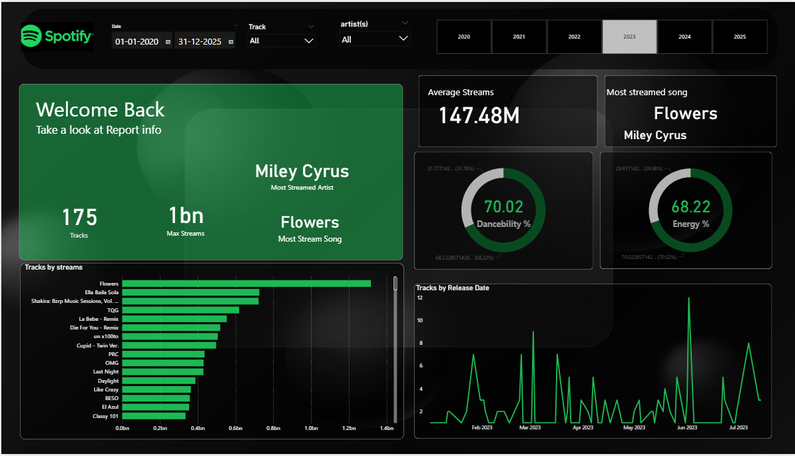
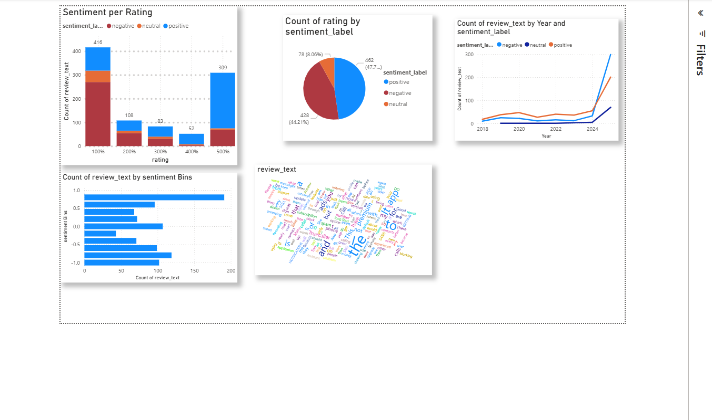

# Power BI Projects 📊

  
  
  

Welcome! I’m **Esha**, a 4th-year B.Tech student passionate about **Data Analysis and Visualization** using Power BI. 🚀  

---

## 🌟 Projects

### 1. [Spotify Analysis](power%20bi/spotify%20analysis)

🎵 Analyze Spotify data to uncover trends in songs, artists, and user preferences.  
📊 Power BI dashboards visualize insights clearly.  

---

### 2. [Truecaller Analysis](power%20bi/Trucaller%20analysis)

📞 Explore Truecaller data to identify call patterns, spam trends, and user behavior.  
💻 Dashboards built in Power BI, with optional SQL integration for enhanced analysis.  

---

## 🛠 Skills
- **Power BI** – Data Visualization & Dashboards  
- **SQL** – Database management & queries (optional for Truecaller Analysis)  
- **Data Analysis** – Extract insights and patterns  

---

Feel free to explore the projects and see how data tells stories! 🌈  
